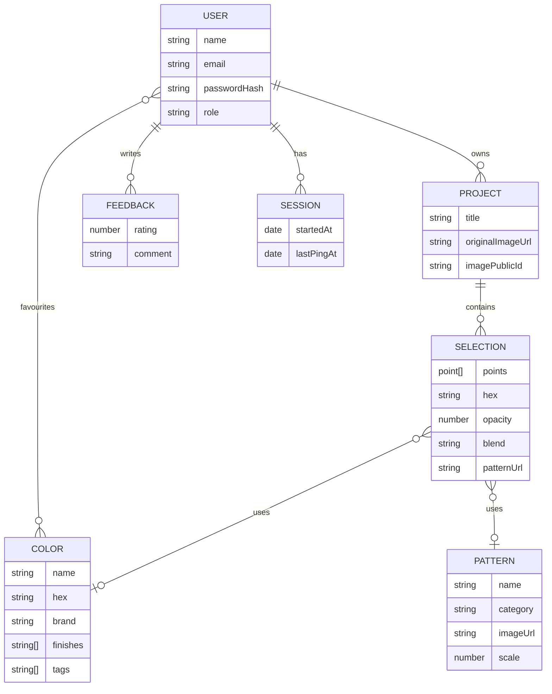

# Database schema

```mermaid
erDiagram
  USER ||--o{ PROJECT : owns
  USER ||--o{ FEEDBACK : writes
  USER ||--o{ SESSION : has
  USER }o--o{ COLOR : favourites
  PROJECT ||--o{ SELECTION : contains
  SELECTION }o--o| COLOR : uses
  SELECTION }o--o| PATTERN : uses

  USER { string name string email string passwordHash string role }
  COLOR { string name string hex string brand string[] finishes string[] tags }
  PATTERN { string name string category string imageUrl number scale }
  PROJECT { string title string originalImageUrl string imagePublicId }
  SELECTION { point[] points string hex number opacity string blend string patternUrl }
  FEEDBACK { number rating string comment }
  SESSION { date startedAt date lastPingAt }
```
